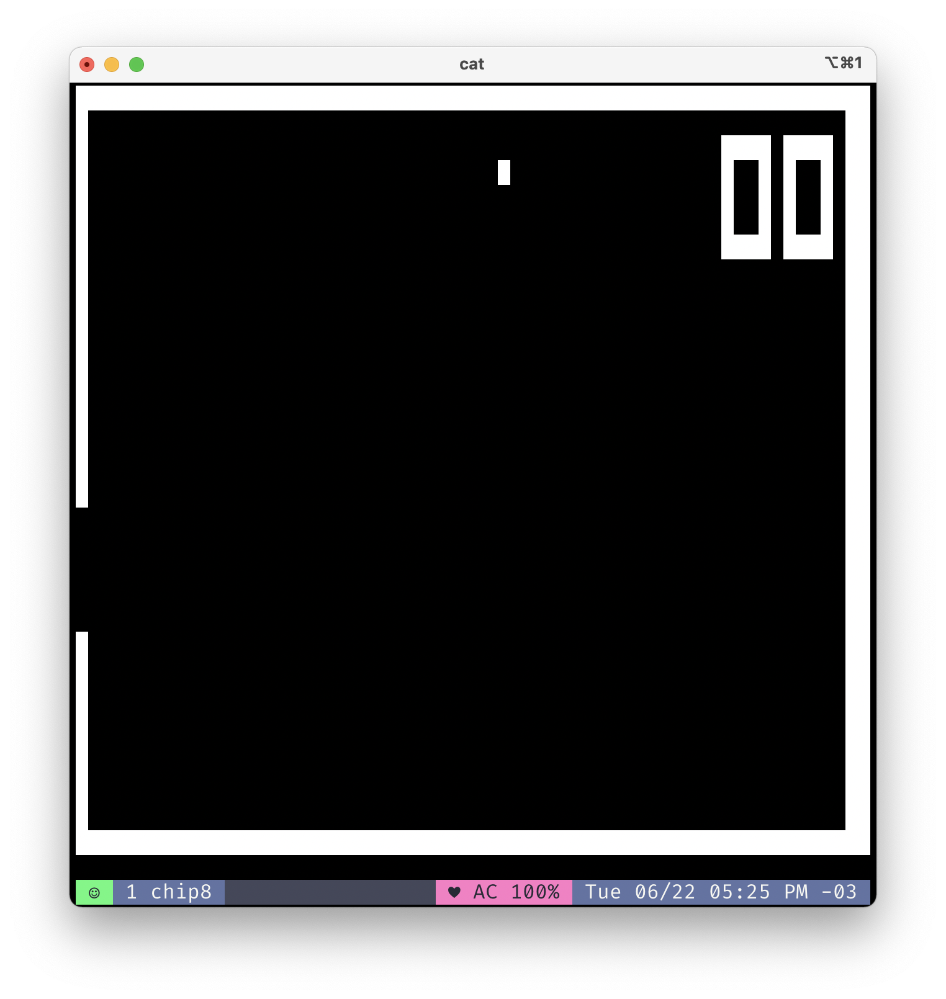

# chip8

An implementation of the CHIP-8 for Rust in ~350 lines of code.



## What is CHIP-8?

CHIP-8 is a virtual machine (along with a supporting programming language).
Since the CHIP-8 VM does not expose the fact that it's running on a host CPU,
in theory the VM could be translated to physical hardware.

The CHIP-8 VM was used in the late '70s on some computers such as the [Telmac
1800](https://en.wikipedia.org/wiki/Telmac_1800) and on some calculators in the
1980's.

CHIP-8 was mainly used as a gaming platform, and today you can play lots of
games like Pong and Breakout on it.

## Running a ROM

Given a CHIP-8 ROM, you can start the ROM in the emulator like so:

```bash
    cargo run romfile.ch8
```

## Where to get a ROM?
[Here](https://github.com/dmatlack/chip8/tree/master/roms).

## Information on the emulator

The input is mapped similarly to most other CHIP-8 emulators I have come across:

Row 1|Row 2|Row 3|Row 4
-----|-----|-----|-----
1 - 1|2 - 2|3 - 3|C - 4
4 - Q|5 - W|6 - E|D - R
7 - A|8 - S|9 - D|F - 4
A - Z|0 - X|B - C|F - V

The screen runs at the default resolution of 64x32.

## References

* **Cowgod's Chip-8 Technical Reference:** http://devernay.free.fr/hacks/chip8/C8TECH10.HTM
* **CHIP-8 Wikipedia Page:** https://en.wikipedia.org/wiki/CHIP-8
* **Reddit r/EmuDev commmunity:** https://reddit.com/r/EmuDev


## License

Copyright (c) 2021-present [Daniel Gatis](https://github.com/danielgatis)

Licensed under [MIT License](./LICENSE)

## Buy me a coffee
Liked some of my work? Buy me a coffee (or more likely a beer)

<a href="https://www.buymeacoffee.com/danielgatis" target="_blank"></a>
